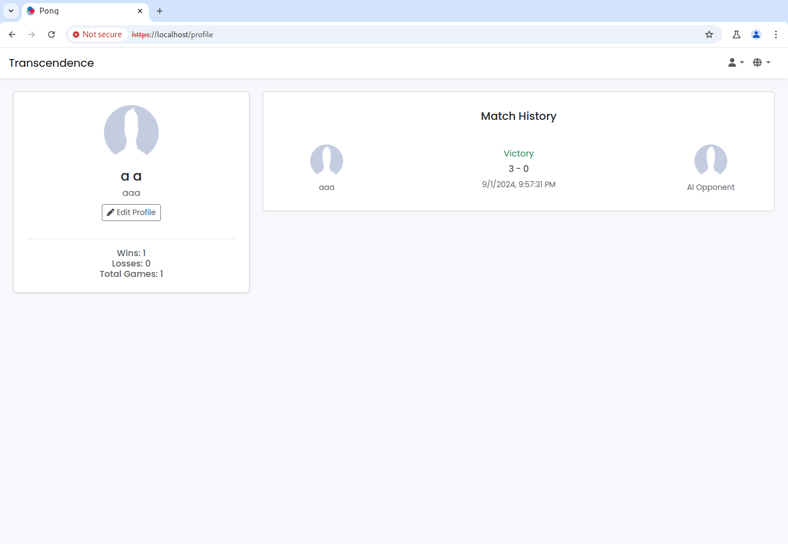
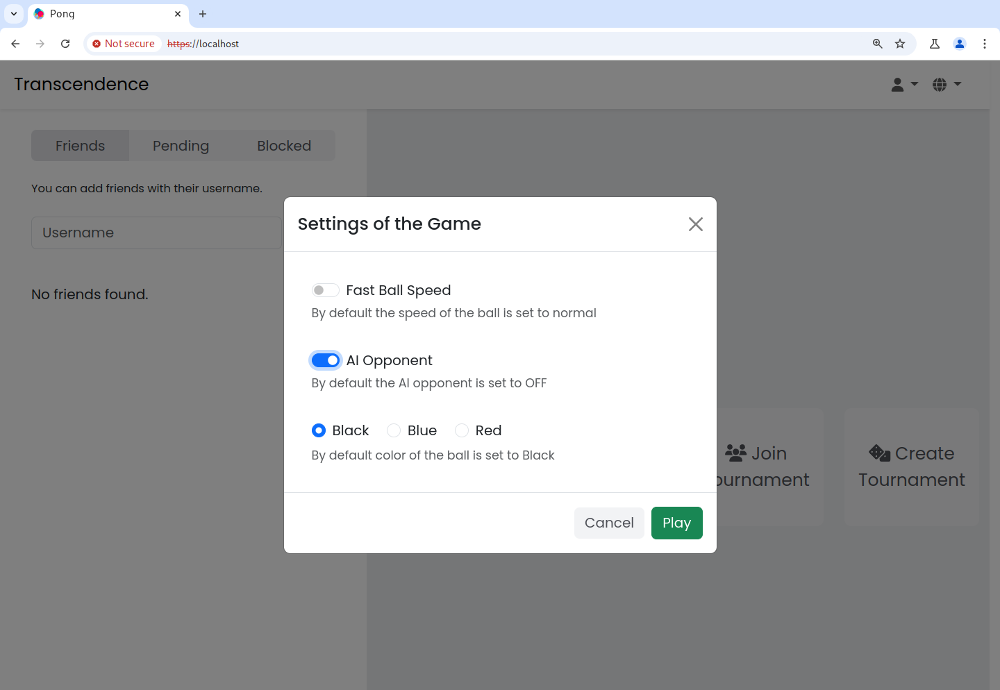
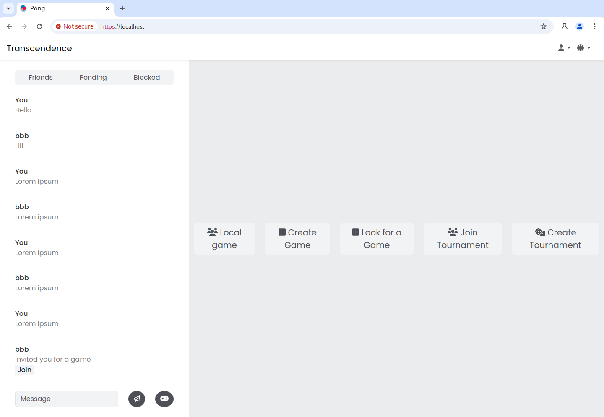
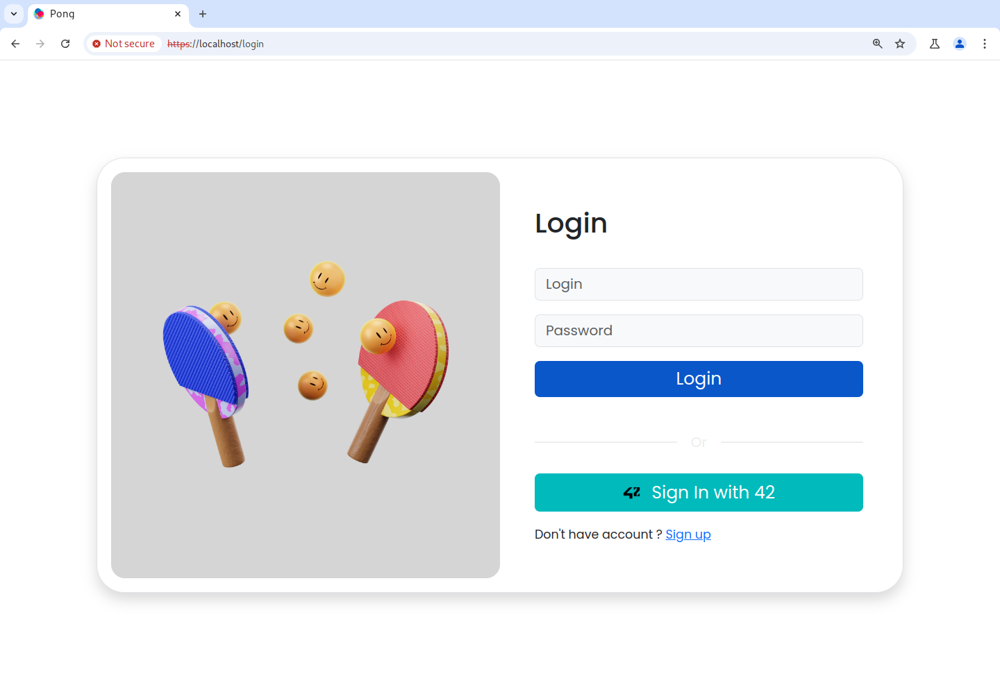

# ft_transcendence
<!-- Improved compatibility of back to top link: See: https://github.com/othneildrew/Best-README-Template/pull/73 -->

<!-- ABOUT THE PROJECT -->
## About The Project

`ft_transcendence` is the final project of the inner project circle at [Ecole 42](https://www.42network.org/).
It is a modern take on the classic pong game, reimagined as a multiplayer web app.

You can find the project subject [here](https://github.com/42-Student-Teams/ft_transcendence/blob/main/ft_transcendence.pdf).

### Technological stack:
* Python Django: API
* Django Channels: Websockets
* Webpack + Vanilla JS
* CSS Bootstrap
* Nginx
* PostgreSQL
* Docker

### Features:
* Vanilla JS single state app with custom routing and component system
* User management with Django's ORM
* JWT and Oauth integration with 42
* Multiplayer through websockets
* Multiple language support

The full set of features can be found [here](https://github.com/42-Student-Teams/ft_transcendence/issues/2).

### Setting up the project
* Clone the repository
* Create and populate both `.env` and `frontend/.env` files. The `BACKEND_IP` should be the domain or the ip of the host.
    `CLIENT_ID`, `CLIENT_SECRET`, `REDIRECT_URI`, and `AUTHORIZATION_URL` are used for 42 Oauth and are not mandatory.
    `BACKEND_IP` is what SSL certificates are generated for.
* Run `docker compose up`

